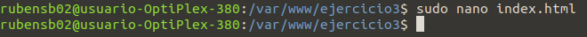
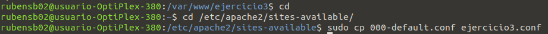
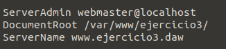

## Rubén Segarra Blasco
# Examen DAW 1º Evaluación

## Ejercicio 2

Lo primero será crear el script. 
```
sudo gedit nombre.sh 
```
Usa sudo para tener permisos de superusuario, gedit es el editor de texto que en este
caso he usado y el nombre que tendrá más la extensión sh para definirlo como un script.

Este es el Script su funcionamiento esta descrito con comentarios presentados de la siguente forma _: 'comentario'_.
```
#!/bin/bash/

if [ $# -eq !0 && $# -eq !0 && $# -eq !0]:'En caso de que tenga 3 parametros '
 then
  if [ $1 -eq == "enable" ]:'Si el primer parametros es enable'
    then
     nano /etc/hosts 
     :'Comando para modificar el /etc/hosts que no se =('
  else :'Si es disable'
   :'Comprueba la ip, si coincide la cambia por la de local host'
  fi
elif [$# -eq !0 && $# -eq !0 && $# -eq 0] :'En caso que tenga solo dos parametros'
 then
  if [ $1 -eq == "enable" ]:'Si el primer parametros es enable'
    then
     nano /etc/hosts 
     :'Comando para modificar el /etc/hosts que no se =('
  else :'Si es disable'
   :'borrara la linea'
  fi
elif [$# -eq !0 && $# -eq 0 && $# -eq 0] :'En caso que tenga solo 1'
 then
  if [$1 == "--help"]
   then
    echo "Esto es una guia, este script puede tener 1, 2 o 3 parametos. El primero enable/disable el segundo nombre de una direccion web o una ip"
  else
   cat script.sh
  fi

else
 echo "error, vuelve mas tarde"
fi

```

### Conclusión
Este ejercicio lo he encontrado bastante dificil. He tenido problemas al intentar modificar el contenido de los archivos y realizar algunas comprobaciones. El lenguaje de _Bash_ tampoco lo ha puesto facil para buscar información sobre su sintaxis o algunas de sus funcionalidades.
Haciendo autocrítica deveria haber trabajado mas con los scrips.

## Ejercicio 3
El primer paso es crear un directorio en /var/www/.


Con el directorio creado, dentro se crea un html que será el índice.




#### Configuración

Segundo paso entrar al fichero de configuración.


Ahora editar el archivo de configuración:  


Añadir el dominio en /etc/hosts:  


Por último activar el fichero de VirtualHost con:  


Resultado final:  


